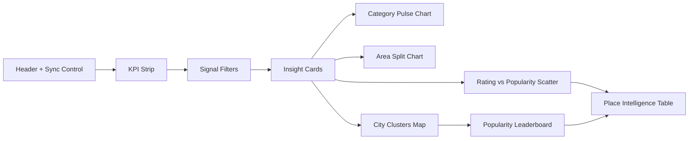
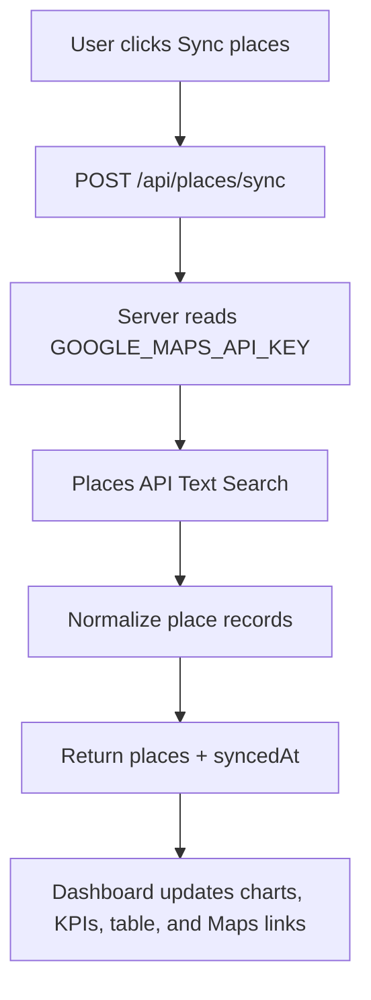

# Maps Pulse Saigon

Maps Pulse Saigon is a neon city-atlas dashboard for analyzing recent Google Maps place activity in Ho Chi Minh City. It turns a seed set of searched or viewed places into an interactive analytics surface with category breakdowns, popularity signals, city clusters, and direct Google Maps links.

The current version is built as a polished local demo for a future Vercel deployment. It uses a 43-place Ho Chi Minh City recents dataset as the baseline and can manually enrich those places with Google Places API data through a server-side sync endpoint.

## What It Does

- Shows recently searched Ho Chi Minh City places across food, nightlife, shopping, education, sports, recreation, and navigation targets.
- Summarizes place popularity using Google Maps ratings and review counts.
- Groups places by dashboard-friendly categories and district areas.
- Visualizes category mix, area split, rating vs review volume, and city clusters.
- Provides filters for category, area, popularity tier, rating threshold, and text search.
- Supports a manual "Sync places" flow that enriches seed records through the Places API without exposing the API key to browser code.

## Dashboard Preview





## How It Was Built

- **Framework:** Next.js App Router with React and TypeScript.
- **Styling:** Tailwind CSS with a custom neon city-atlas visual system.
- **Charts:** Recharts for pie, bar, and scatter visualizations.
- **Icons:** lucide-react for dashboard controls and status indicators.
- **Data model:** Normalized `Place` records with name, category, types, address, district area, rating, review count, coordinates, status, Maps URI, last seen date, and source.
- **Google integration:** Server-side Google Places API Text Search requests using `process.env.GOOGLE_MAPS_API_KEY`.
- **Deployment target:** Vercel-ready Next.js app. API keys should be stored as local or Vercel environment variables only.

## API Features

### `GET /api/places`

Returns the current normalized seed dataset.

```ts
{
  places: Place[]
}
```

Use this endpoint when the UI needs the baseline Ho Chi Minh City place list without running a live enrichment request.

### `POST /api/places/sync`

Enriches the configured seed places through Google Places API Text Search and returns normalized records plus a sync timestamp.

```ts
{
  places: Place[],
  syncedAt: string
}
```

The sync route requests only the fields needed by the dashboard:

- `displayName`
- `formattedAddress`
- `rating`
- `userRatingCount`
- `types`
- `location`
- `businessStatus`
- `googleMapsUri`

The API key is used only on the server and should never be committed, logged, embedded in frontend code, or exposed in screenshots.

## Local Development

Create `.env.local`:

```env
GOOGLE_MAPS_API_KEY=
```

Install dependencies and start the app:

```bash
npm install
npm run dev
```

Open:

```text
http://127.0.0.1:3000
```

## Useful Commands

```bash
npm run dev
npm run build
npm run lint
```

## Project Direction

The long-term goal is an automated Google Maps analytics pipeline:

1. Read the user's Ho Chi Minh City Google Maps recents from a logged-in Maps context.
2. Normalize and deduplicate the place list.
3. Enrich each place with Google Places API details.
4. Store the records in a durable cache or database.
5. Deploy the dashboard to Vercel.
6. Add refresh automation so new searches update the dashboard over time.
