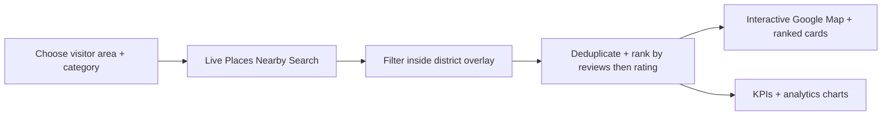

# Go Saigon

A full-stack destination explorer for tourists visiting Ho Chi Minh City. Visitors choose a familiar district and an experience category, then browse highly reviewed Google Maps destinations on an interactive city map with live popularity analytics.

## Experience

- Opens with **District 1 + Landmarks** as the featured discovery query.
- Supports 15 familiar visitor areas and seven categories: Food, Nightlife & Recreation, Shopping, Landmarks, Campus & Education, Sport & Fitness, and Services.
- Returns up to 20 live Google Places results ordered by review count, rating, and then name.
- Shows ranked destination cards, Google Maps links, photos and attributions, map pins, review-volume charts, rating analysis, and experience-type breakdowns.
- Uses a licensed 2020 district overlay for tourist-friendly area selection while clearly distinguishing it from current administrative boundaries.

## Application Flow



## Stack

- Next.js App Router, React, TypeScript, and Tailwind CSS
- Recharts analytics and lucide-react controls
- `@vis.gl/react-google-maps` for the real Google map and destination markers
- Turf for district polygon inclusion checks
- Google Places API (New) for live destination details and photos
- Neon Postgres and Drizzle ORM for place-ID-only associations and anonymous discovery metrics
- Upstash Redis rate limiting for public API protection

## API

### `GET /api/discovery/options`

Returns visitor-area and category selector data, including the default District 1 / Landmarks selection.

### `POST /api/discovery/search`

Accepts:

```json
{ "areaId": "district-1", "categoryId": "landmarks" }
```

Returns up to 20 current Google Places destinations, strictly ranked by `userRatingCount` descending, then `rating` descending, then name. Responses are `no-store`; Google place display content is not persisted as a catalog.

### `GET /api/discovery/photo`

Proxies one immediately displayed Google Places photo through a short-lived signed reference so the server Places key is not exposed in browser URLs. The UI displays the returned photo attribution.

## Google Data And Storage

The database stores only application-owned configuration, anonymous request metrics, and Google place IDs discovered for an area/category pair. Live place names, ratings, review counts, addresses, links, photos, and raw Google responses are retrieved when a visitor searches and are not stored.

Place content and photos are provided by Google Maps Platform. Visitor-area boundaries come from **geoBoundaries VNM ADM2 (2020), OCHA ROAP / Government of Viet Nam**, licensed under **CC BY 3.0 IGO**.

## Local Development

Create `.env.local` from `.env.example` and configure:

```env
GOOGLE_MAPS_API_KEY=
NEXT_PUBLIC_GOOGLE_MAPS_BROWSER_KEY=
NEXT_PUBLIC_GOOGLE_MAPS_MAP_ID=
DATABASE_URL=
UPSTASH_REDIS_REST_URL=
UPSTASH_REDIS_REST_TOKEN=
```

- Restrict `GOOGLE_MAPS_API_KEY` to Places API (New) and server use.
- Restrict `NEXT_PUBLIC_GOOGLE_MAPS_BROWSER_KEY` by HTTP referrer and Maps JavaScript API.
- Configure `DATABASE_URL` to enable durable place-ID associations.
- Configure Upstash values to enable public endpoint rate limiting.

```bash
npm install
npm run db:migrate
npm run dev
```

Open `http://127.0.0.1:3000`.

## Verification

```bash
npm run test
npm run lint
npm run build
```

## Policy Pages

The app includes public [Privacy](/privacy) and [Terms](/terms) pages describing Google content handling, attribution, ranking limitations, and boundary data provenance.
